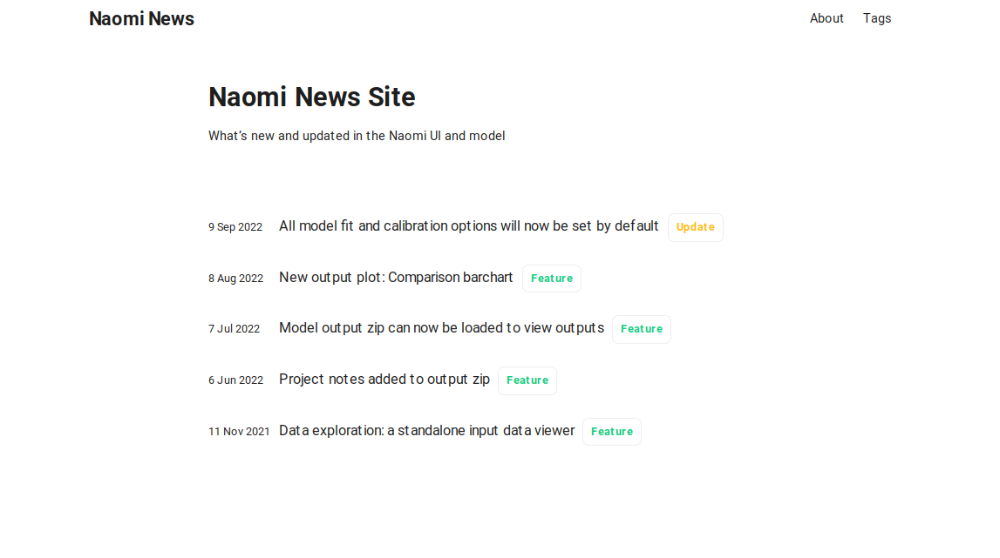
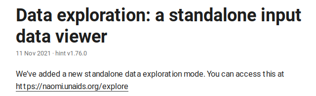

# papermod-changelog

This theme is an extension of https://github.com/adityatelange/hugo-PaperMod and must be used with that.

Set your theme in your `config.yml` to
```
theme: ["papermod-changelog", "PaperMod"]
```

This updates some of the styling and adds some small features to make the site better for displaying software changelogs.

## Features

### Configure tags and colours

In your `config.yml` you can define a set tags and their display colours. e.g.

```
tags:
  - text: Update
    colour: "#FFBA11"
  - text: Feature
    colour: "#14CC80"
  - text: Model
    colour: "#E31837"
```

Add the tag on a post in the front matter
```
title: "Data exploration: a standalone input data viewer"
date: 2021-11-24
tags: ["Feature"]
```

This will render on the site with styling using the configured colour.


### Show version info in post metadata

Add an array of `version` info into the content front matter and it will be shown in the post header e.g.

```
---
title: "Data exploration: a standalone input data viewer"
date: 2021-11-24
version: ["hint v1.76.0"]
tags: ["Feature"]
---
```

This will show each item in the version array in the post header

